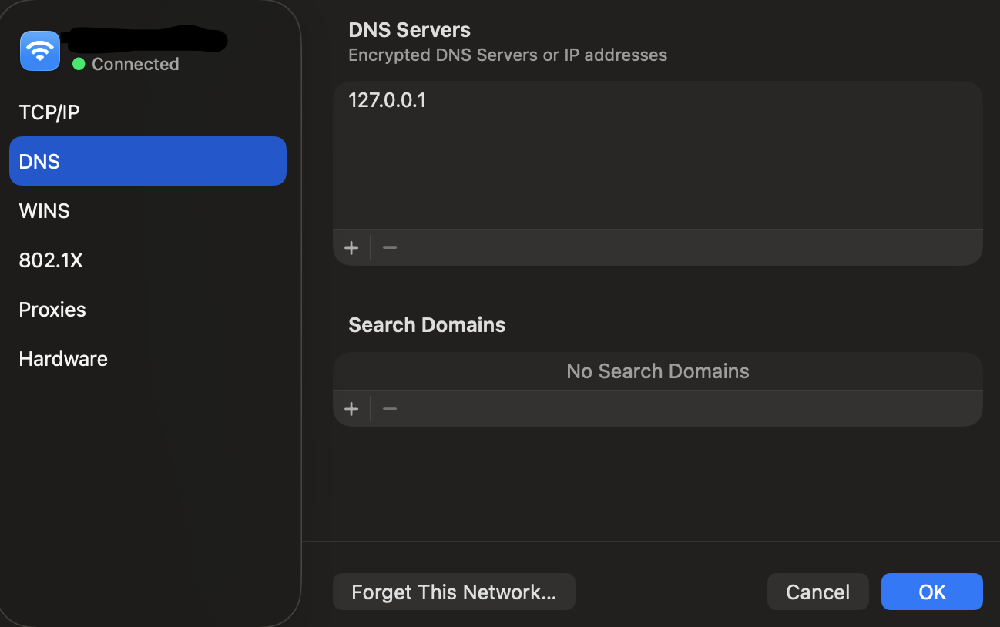

# AdGuard Home - Local DNS Filtering Setup

Block ads, trackers, and malicious domains locally on your machine using AdGuard Home as your DNS server.

## Prerequisites

- Docker and Docker Compose
- [Task](https://taskfile.dev/) - Install with: `brew install go-task` (macOS) or see [installation guide](https://taskfile.dev/installation/)

## Quick Start

### 1. Start AdGuard Home
```bash
task up
```

This will automatically:
- Copy `AdGuardHome.yaml` to `data/conf/`
- Start the Docker container
- AdGuard Home will be available at `http://127.0.0.1`

### 2. Create Admin Account
- Open your browser and go to: `http://127.0.0.1`
- You'll be prompted to create an admin username and password
- The setup wizard is skipped - AdGuard is pre-configured and ready!

### 3. Configure Your System DNS

Point your system DNS to `127.0.0.1` so all DNS queries go through AdGuard for filtering.

---

## macOS DNS Setup (GUI Method)

1. Open **System Settings** (or System Preferences on older macOS)
2. Click on **Network**
3. Select your active connection (Wi-Fi or Ethernet)
4. Click **Details...** button
5. Click on the **DNS** tab in the left sidebar
6. Under "DNS Servers", click the **+** button
7. Type `127.0.0.1` and press Enter
8. Click **OK** to save

**Visual Guide:**



Your DNS settings should look like the screenshot above - with `127.0.0.1` added as a DNS server. The connection status should show a green dot with "Connected" when properly configured.

### macOS CLI Method

Alternatively, use the command line:

```bash
# For Wi-Fi
sudo networksetup -setdnsservers Wi-Fi 127.0.0.1

# For Ethernet
sudo networksetup -setdnsservers Ethernet 127.0.0.1

# Verify settings
scutil --dns | grep nameserver
```

### Restore Original DNS (macOS)

To revert back to automatic DNS:

```bash
# GUI: System Settings → Network → Your Connection → Details → DNS → Remove 127.0.0.1
# Or use CLI:
sudo networksetup -setdnsservers Wi-Fi "Empty"
```

---

## Linux DNS Setup

### Using NetworkManager (GUI)
1. Open Network Settings
2. Select your connection
3. Go to IPv4 or IPv6 settings
4. Change DNS method to "Manual"
5. Add DNS server: `127.0.0.1`
6. Apply changes

### Using NetworkManager (CLI)
```bash
# Find your connection name
nmcli connection show

# Set DNS to 127.0.0.1
sudo nmcli con mod "Your-Connection-Name" ipv4.dns "127.0.0.1"

# Restart connection
sudo nmcli con up "Your-Connection-Name"
```

### Using systemd-resolved
```bash
# Edit resolved.conf
sudo nano /etc/systemd/resolved.conf

# Add under [Resolve]:
DNS=127.0.0.1

# Restart service
sudo systemctl restart systemd-resolved
```

---

## Windows DNS Setup

1. Open **Control Panel** → **Network and Internet** → **Network Connections**
2. Right-click your active network connection
3. Select **Properties**
4. Select **Internet Protocol Version 4 (TCP/IPv4)**
5. Click **Properties**
6. Select **Use the following DNS server addresses**
7. Enter `127.0.0.1` as Preferred DNS server
8. Click **OK** to save

---

## Verify DNS is Working

After configuring DNS, test that AdGuard is filtering your traffic:

```bash
# Test DNS resolution
nslookup google.com 127.0.0.1

# Check if ads are blocked
nslookup ads.google.com 127.0.0.1
```

You can also check the AdGuard Home dashboard at `http://127.0.0.1` to see query logs and statistics.

---

## Pre-configured Features

- **DNS Filtering:** Enabled with AdGuard DNS filter and AdAway blocklist
- **Upstream DNS:** Cloudflare (1.1.1.1) and Google (8.8.8.8) with DNS-over-HTTPS
- **Query Logging:** Enabled (90 days retention)
- **Statistics:** Enabled (24-hour intervals)
- **Cache:** 4MB cache for faster responses
- **Rate Limiting:** 20 queries per second per client

All settings can be customized in the web interface at `http://127.0.0.1`

---

## Available Commands

```bash
# Start AdGuard (copies config + starts container)
task up

# Stop AdGuard
task down

# Restart AdGuard
task restart

# View logs
task logs

# Check status
task status

# Clean everything (DESTRUCTIVE - removes all data)
task clean

# Manually copy config only
task setup
```

---

## Manual Docker Compose Commands

If you prefer not to use Task:

```bash
# Copy config first
mkdir -p data/conf && cp AdGuardHome.yaml data/conf/

# Start container
docker-compose up -d

# Stop container
docker-compose down

# View logs
docker-compose logs -f
```

---

## Configuration

- **Base configuration:** `./AdGuardHome.yaml` (tracked in git)
- **Runtime configuration:** `./data/conf/AdGuardHome.yaml` (auto-copied on `task up`)
- **Data directory:** `./data/` (gitignored, contains logs and runtime state)

### Updating Configuration

Changes made in the web UI are saved to `./data/conf/AdGuardHome.yaml`.

To update the base configuration:
1. Edit `./AdGuardHome.yaml`
2. Run `task setup` to copy changes
3. Run `task restart` to apply

---

## Troubleshooting

### DNS not resolving
```bash
# Check if AdGuard is running
docker ps | grep adguard

# Check logs
task logs

# Restart AdGuard
task restart
```

### Port 53 already in use
On macOS, you may need to stop the local DNS responder:
```bash
sudo launchctl unload -w /System/Library/LaunchDaemons/com.apple.mDNSResponder.plist
```

### Reset everything
```bash
# This removes all data and configuration
task clean

# Start fresh
task up
```

---

## Security Notes

- All ports are bound to `127.0.0.1` only - no external access
- DNS traffic is filtered locally before being forwarded to upstream DNS
- Upstream DNS uses DNS-over-HTTPS for encrypted queries
- No DNS queries leave your machine unencrypted

---

## License

MIT
